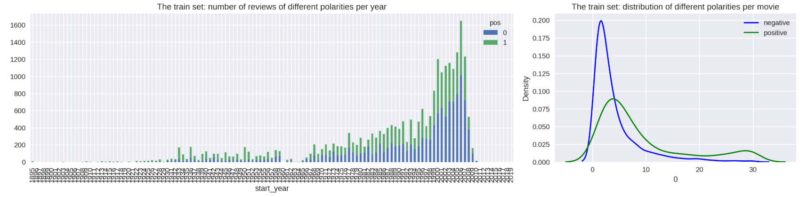
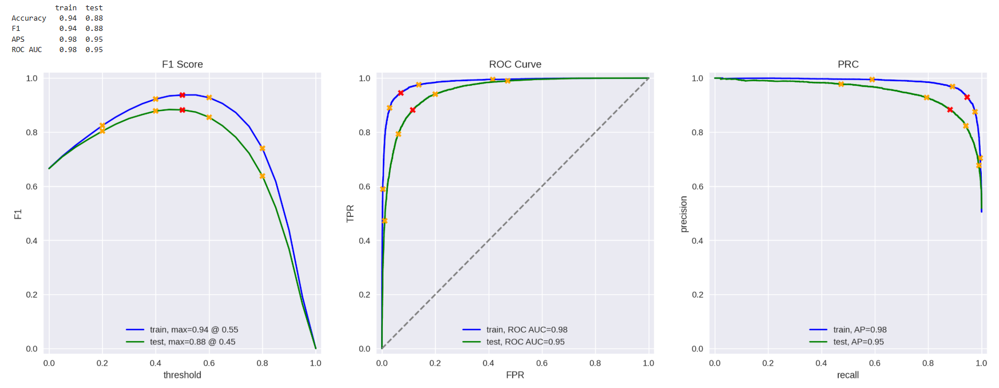

# Sprint 14 Project: Machine Learning for Texts
 
---

### 📚 Table of Contents
- 🔍 [Project Overview](#project-overview)
- 📈 [Conclusion](#conclusion)
- 🖼️ [Sample Outputs](#sample-outputs)
- 📁 [Files](#files)

---

## Project Overview

The Film Junky Union, a new edgy community for classic movie enthusiasts, is developing a system for filtering and categorizing movie reviews. The goal is to train a model to automatically detect negative reviews. You'll be using a dataset of IMBD movie reviews with polarity labelling to build a model for classifying positive and negative reviews. It will need to reach an F1 score of at least 0.85.

---

## Conclusion

The purpose of this project was to develop a model to automatically detect negative film reviews for the Film Junky Union with an F1 score of at least 0.85. The relevant data were appropriately formatted for modeling, the class imbalance was negligible, and the training and testing datasets were comparable. I relied exclusively on the review texts and the target (positive vs. negative).

I trained and tested five models:
Model 0: a dummy constant model
Model 1: a logistic regression model using TF-IDF features and NLTK stopwords
Model 2: a logistic regression model using TF-IDF features, spaCy lemmatization, and NLTK stopwords
Model 3: a LightGBM gradient-boosted decision tree classifier using TF-IDF features, spaCy lemmatization, and NLTK stopwords
Model 9: a logistic regression model using BERT embeddings (for a small subset of 50 reviews)

As expected, Model 0 performed very poorly (F1 = 0) and Model 9 performed modestly (F1 = 0.78) because they had restricted access to the data. Model 0 used no training data and Model 9 trained on a miniscule subset of reviews. The remaining models all performed well with Model 1 (F1 = 0.88) edging out Model 2 (F1 = 0.88) and Model 3 (F1 = 0.86). Tuning hyperparameters and thresholds might further improve F1 scores, but those three models all exceeded the project goal of 0.85. Plots confirmed that Models 1-3 were effectively equivalent with little overfitting and excellent precision and discrimination. Overall, Model 1 was the best because it was the highest-scoring and least complex of the adequate models.

To further explore the models on an illustrative sample, I wrote ten reviews of varying positivity and applied the models to them. Models 1, 2, 3, and 9 all performed reasonably well. The model-derived probabilities correlated strongly with my subjective rankings (r ≤ -0.74) and the classifications scored reasonably well (F1 ≥ 0.75), especially considering the tiny sample size. In general, the models were better at classifying negative reviews than positive ones. Model 3 was the best model for my reviews (r = -0.94, F1 = 0.91), far outperforming the others and misclassifying only one review.

It is curious that different models were best for the full corpus and my personal reviews. Model 3 is more complex, capturing non-linear dynamics and feature interactions that Model 1 cannot. My personal reviews may be more nuanced and equivocal than most reviews in the corpus. My writing style tends toward complexity and qualification instead of strong, categorical statements. That might explain why Model 3 was clearly better for my reviews but slightly worse than Model 1 for the full corpus. Writing style matters for sentiment analysis and model performance probably reflects my idiosyncrasies. The full corpus much better represents reviews of interest to the Film Junky Union than my small personal sample.

In conclusion, I recommend that the Film Junky Union adopt Model 1 because it best balances performance and complexity for the full corpus.

---

## Sample Outputs

Here are two key moments from the analysis:

  
*Review polarity and volume over time in the training set. Positive reviews dominate recent decades, while older films show fewer reviews and different sentiment patterns.*

 

  
*Final model evaluation metrics show strong generalization performance across F1, ROC AUC, and precision-recall, with a well-calibrated threshold.*

---

## Files

📄 See the full analysis in [`sprint-14-project.ipynb`](./sprint-14-project.ipynb)  
📄 Or view a static version in [`sprint-14-project.html`](./sprint-14-project.html)  
📄 Project background: [`project-description.md`](./project-description.md)

> Note: This project uses one dataset, `imdb_reviews.tsv`, which was omitted from the `/data/` folder due to GitHub file size limits.  
> See [`/data/README.md`](./data/README.md) for details.
